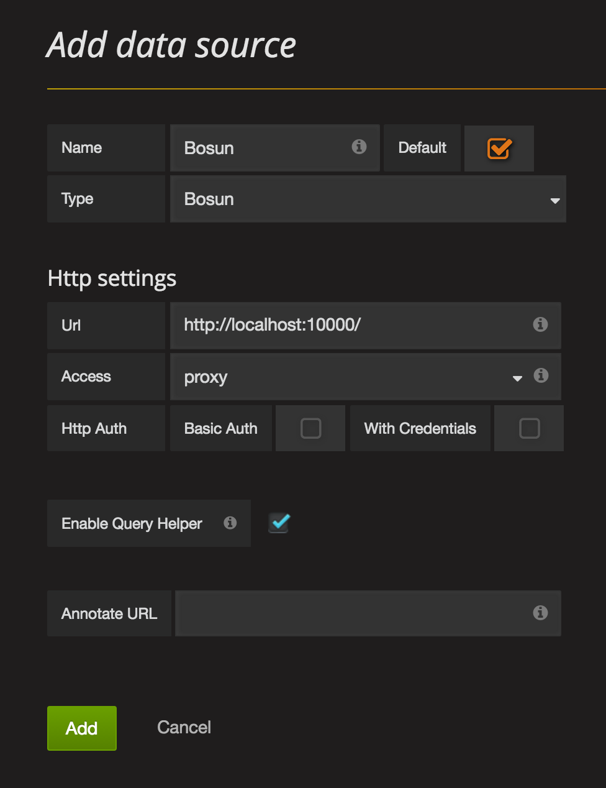

# Quick start with Bosun using Ansible (+Vagrant)

From [Bosun home page](http://bosun.org/):

> Bosun is an open-source, MIT licensed, monitoring and alerting system by Stack Exchange. It has an expressive domain specific language for evaluating alerts and creating detailed notifications. It also lets you test your alerts against history for a faster development experience.

## This repository

This repo is an example of complete Bosun deployment, using HBase, OpenTSDB and Grafana. It has nginx as a front proxy and uses HTTP authentication (this required patching Grafana's render.js).

To get Bosun up and running in a local VM, [install Ansible](http://docs.ansible.com/ansible/intro_installation.html) and [Vagrant](https://www.vagrantup.com/downloads.html) and run:

    vagrant up

You should get an Ubuntu 14.04 VM with the full Bosun stack installed. Credentials will be shown at the end of installation output.

Nothing should prevent you from running this playbook (bosun.yml) on another infrastructure, but it basically requires Ubuntu 14.04 (or possibly 12.04) running Upstart on amd64.

## Setting up a data source

The [Bosun data source plugin](https://grafana.net/plugins/bosun-datasource) comes preinstalled so you only need to add a data source to Grafana.

Go to http://(domain)/grafana/datasources/new and add a data source with the following configuration:

